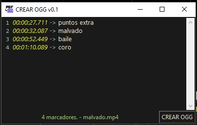
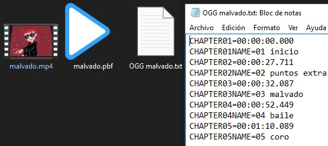

# PBF a OGG
realizado con python 3.10 y tkinter

## Funcion
extrae informacion de un archivo PBF para convertirlos a un archivo de texto con formato OGG

obtiene el tiempo y el titulo de cada marcador, el tiempo lo convierte a Timestamp

 > [!NOTE]
 > En el caso de la imagen del marcador, esta en un formato hexadecimal unida con unos datos que no se que son, no se si es la cabecera de la imagen con metadata de la imagen o algo asi (por que no hay informacion sobre como trabaja y el formato del mismo), por lo que opte por solo mostrar en el programa tiempo y titulo que son los necesarios para crear el archivo OGG

en una version posterior agregare tambien la imagen del marcador no es necesario (pero quiero que obtenga toda la informacion del archivo PBF) y ya casi lo desifre a prueba y error

---

En un archivo **PBF** estan los marcadores de un video generados con el reproductor de videos Potplayer

**librerias**:
 * ~~tkinterdnd2               0.3.0~~
 * tkinterdnd2-universal     1.7.3

tkinterdnd2 *este creo que no lo use por que si mal no recuerdo crea usaba una version que no me era compatible*

